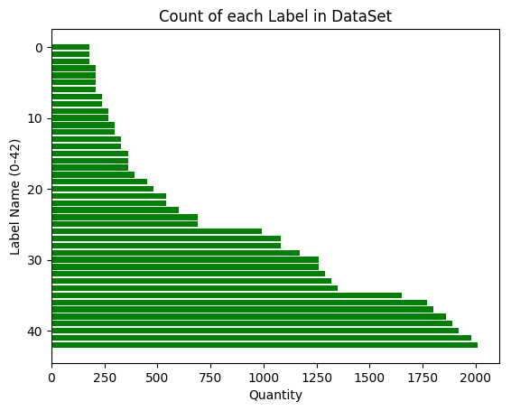
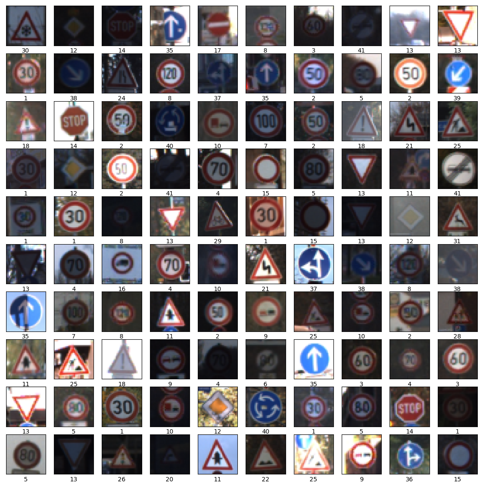
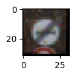
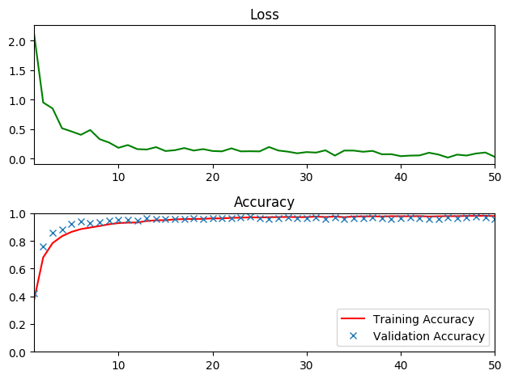
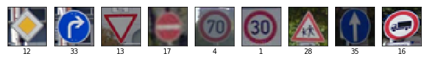
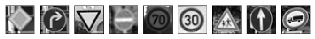
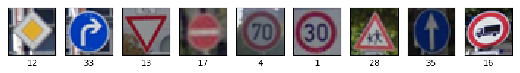

# Self-Driving Car Engineer Nanodegree

## Deep Learning

## Project: Build a Traffic Sign Recognition Classifier

In this notebook, a template is provided for you to implement your functionality in stages, which is required to successfully complete this project. If additional code is required that cannot be included in the notebook, be sure that the Python code is successfully imported and included in your submission if necessary. 

> **Note**: Once you have completed all of the code implementations, you need to finalize your work by exporting the iPython Notebook as an HTML document. Before exporting the notebook to html, all of the code cells need to have been run so that reviewers can see the final implementation and output. You can then export the notebook by using the menu above and navigating to  \n",
    "**File -> Download as -> HTML (.html)**. Include the finished document along with this notebook as your submission. 

In addition to implementing code, there is a writeup to complete. The writeup should be completed in a separate file, which can be either a markdown file or a pdf document. There is a [write up template](https://github.com/udacity/CarND-Traffic-Sign-Classifier-Project/blob/master/writeup_template.md) that can be used to guide the writing process. Completing the code template and writeup template will cover all of the [rubric points](https://review.udacity.com/#!/rubrics/481/view) for this project.

The [rubric](https://review.udacity.com/#!/rubrics/481/view) contains "Stand Out Suggestions" for enhancing the project beyond the minimum requirements. The stand out suggestions are optional. If you decide to pursue the "stand out suggestions", you can include the code in this Ipython notebook and also discuss the results in the writeup file.


>**Note:** Code and Markdown cells can be executed using the **Shift + Enter** keyboard shortcut. In addition, Markdown cells can be edited by typically double-clicking the cell to enter edit mode.

---
## Step 0: Load The Data


```python
# Load pickled data
import tensorflow as tf
import pickle
import pandas as pd
import matplotlib.gridspec as gridspec
import matplotlib.image as mpimg
import numpy as np
import matplotlib.pyplot as plt
import cv2
from sklearn.utils import shuffle
import math
import os
```


```python
# TODO: Fill this in based on where you saved the training and testing data

training_file = 'traffic-signs-data/train.p'
validation_file= 'traffic-signs-data/valid.p'
testing_file = 'traffic-signs-data/test.p'

with open(training_file, mode='rb') as f:
    train = pickle.load(f)
with open(validation_file, mode='rb') as f:
    valid = pickle.load(f)
with open(testing_file, mode='rb') as f:
    test = pickle.load(f)
    
X_train, y_train = train['features'], train['labels']
X_valid, y_valid = valid['features'], valid['labels']
X_test, y_test = test['features'], test['labels']
```

---

## Step 1: Dataset Summary & Exploration

The pickled data is a dictionary with 4 key/value pairs:

- `'features'` is a 4D array containing raw pixel data of the traffic sign images, (num examples, width, height, channels).
- `'labels'` is a 1D array containing the label/class id of the traffic sign. The file `signnames.csv` contains id -> name mappings for each id.
- `'sizes'` is a list containing tuples, (width, height) representing the original width and height the image.
- `'coords'` is a list containing tuples, (x1, y1, x2, y2) representing coordinates of a bounding box around the sign in the image. **THESE COORDINATES ASSUME THE ORIGINAL IMAGE. THE PICKLED DATA CONTAINS RESIZED VERSIONS (32 by 32) OF THESE IMAGES**

Complete the basic data summary below. Use python, numpy and/or pandas methods to calculate the data summary rather than hard coding the results. For example, the [pandas shape method](http://pandas.pydata.org/pandas-docs/stable/generated/pandas.DataFrame.shape.html) might be useful for calculating some of the summary results. 

### Provide a Basic Summary of the Data Set Using Python, Numpy and/or Pandas


```python
### Replace each question mark with the appropriate value. 
### Use python, pandas or numpy methods rather than hard coding the results

# TODO: Number of training examples
n_train = len(train['features'])

# TODO: Number of validation examples
n_validation = len(valid['features'])

# TODO: Number of testing examples.
n_test = len(test['features'])

# TODO: What's the shape of an traffic sign image?
image_shape = X_train[0].shape

# TODO: How many unique classes/labels there are in the dataset.
n_classes = len(set(train['labels']))

print("Number of training examples =", n_train)
print("Number of testing examples =", n_test)
print("Image data shape =", image_shape)
print("Number of classes =", n_classes)
```

    Number of training examples = 34799
    Number of testing examples = 12630
    Image data shape = (32, 32, 3)
    Number of classes = 43


### Include an exploratory visualization of the dataset

Visualize the German Traffic Signs Dataset using the pickled file(s). This is open ended, suggestions include: plotting traffic sign images, plotting the count of each sign, etc. 

The [Matplotlib](http://matplotlib.org/) [examples](http://matplotlib.org/examples/index.html) and [gallery](http://matplotlib.org/gallery.html) pages are a great resource for doing visualizations in Python.

**NOTE:** It's recommended you start with something simple first. If you wish to do more, come back to it after you've completed the rest of the sections. It can be interesting to look at the distribution of classes in the training, validation and test set. Is the distribution the same? Are there more examples of some classes than others?


```python
### Data exploration visualization code goes here.
### Feel free to use as many code cells as needed.

# count number of times each label is in dataset
df = pd.DataFrame(train['labels'])
series = pd.Series(train['labels'])
val_list = series.value_counts().sort_values()
# sorted_label_count = []
# for i in range(0, len(val_list)):
#     sorted_label_count.append(val_list[i])
```


```python
import matplotlib.pyplot as plt
# Visualizations will be shown in the notebook.
%matplotlib inline

plt.rcdefaults()
fig, ax = plt.subplots()

plot_y = range(0,len(val_list))

ax.barh(plot_y, val_list, align='center',
        color='green', ecolor='black')
ax.invert_yaxis()  # labels read top-to-bottom
ax.set_xlabel('Quantity')
ax.set_ylabel('Label Name (0-42)')
ax.set_title('Count of each Label in DataSet')

plt.show()

```





```python
fig = plt.figure(figsize=(14, 14))
for i in range(0, 100):
    num = np.random.randint(0, len(X_train))
    axis = fig.add_subplot(10,10,i+1)
    axis.set_xlabel(y_train[num])
    plt.xticks(np.array([]))
    plt.yticks(np.array([]))
    axis.imshow(X_train[num])
plt.show()
```





----

## Step 2: Design and Test a Model Architecture

Design and implement a deep learning model that learns to recognize traffic signs. Train and test your model on the [German Traffic Sign Dataset](http://benchmark.ini.rub.de/?section=gtsrb&subsection=dataset).

The LeNet-5 implementation shown in the [classroom](https://classroom.udacity.com/nanodegrees/nd013/parts/fbf77062-5703-404e-b60c-95b78b2f3f9e/modules/6df7ae49-c61c-4bb2-a23e-6527e69209ec/lessons/601ae704-1035-4287-8b11-e2c2716217ad/concepts/d4aca031-508f-4e0b-b493-e7b706120f81) at the end of the CNN lesson is a solid starting point. You'll have to change the number of classes and possibly the preprocessing, but aside from that it's plug and play! 

With the LeNet-5 solution from the lecture, you should expect a validation set accuracy of about 0.89. To meet specifications, the validation set accuracy will need to be at least 0.93. It is possible to get an even higher accuracy, but 0.93 is the minimum for a successful project submission. 

There are various aspects to consider when thinking about this problem:

- Neural network architecture (is the network over or underfitting?)
- Play around preprocessing techniques (normalization, rgb to grayscale, etc)
- Number of examples per label (some have more than others).
- Generate fake data.

Here is an example of a [published baseline model on this problem](http://yann.lecun.com/exdb/publis/pdf/sermanet-ijcnn-11.pdf). It's not required to be familiar with the approach used in the paper but, it's good practice to try to read papers like these.

### Pre-process the Data Set (normalization, grayscale, etc.)

>"Minimally, the image data should be normalized so that the data has mean zero and equal variance. For image data, `(pixel - 128)/ 128` is a quick way to approximately normalize the data and can be used in this project. 

>Other pre-processing steps are optional. You can try different techniques to see if it improves performance. 

>Use the code cell (or multiple code cells, if necessary) to implement the first step of your project."

## LeNet Quote about Adding Jitter to Image Set


>Additionally, we build a **jittered dataset** by adding 5
transformed versions of the original training set, yielding
126,750 samples in total. **Samples are randomly perturbed in
position ([-2,2] pixels), in scale ([.9,1.1] ratio) and rotation
([-15,+15] degrees).** ConvNets architectures have built-in
invariance to small translations, scaling and rotations. **When
a dataset does not naturally contain those deformations,
adding them synthetically will yield more robust learning
to potential deformations in the test set.** We demonstrate the
error rate gain on the validation set in table I. Other realistic
perturbations would **probably also increase robustness such
as other affine transformations, brightness, contrast and blur.**

# Functions to Augment Training / Validation Sets


```python
def toGrayscale(imgSet):
    """
    Convert to Grayscale
    Referenced http://www.tannerhelland.com/3643/grayscale-image-algorithm-vb6/ for grayscale conversion coefficients
    """
    return np.dot(imgSet[...,:3],[0.299,0.587,0.114])

def normalize_grayscale(image_data):
    """
    Normalize the image data with Min-Max scaling to a range of [0.1, 0.9]
    :param image_data: The image data to be normalized
    :return: Normalized image data
    """
    a, b = [-1., 1.]  # output range (make sure to do 1. to output float vs int)
    xMin, xMax = [0., 255.] #input range
    return (a + np.divide((np.multiply((image_data - xMin),(b - a))), (xMax - xMin)))

def rotate(img, max_rotation):
    """
    Rotate image + or - max_rotation degrees.
    Referenced: http://docs.opencv.org/trunk/da/d6e/tutorial_py_geometric_transformations.html
    """
    # Get row / col info from image shape
    rows, cols = img.shape[:2]
    # Generate an angle bounded by max_rotation
    angle = np.random.uniform(-max_rotation, max_rotation)
    matrix = cv2.getRotationMatrix2D((cols/2, rows/2), angle, 1)
    # Apply rotation
    new_img = cv2.warpAffine(img, matrix, (cols, rows))
    return new_img

def adjust_brightness(img):
    """
    Adjust image brightness (between 50% and 150%)
    Referenced: http://docs.opencv.org/trunk/da/d6e/tutorial_py_geometric_transformations.html
    """
    # Randomly generate new brightness level (between 50% and 150%)
    brightness = np.random.uniform(0.5,1.5)
    # Convert to HSV color space (Hue Saturation Value)
    img = cv2.cvtColor(img, cv2.COLOR_RGB2HSV)
    img = np.array(img, dtype = np.float64)
    img[:,:,2] = img[:,:,2] * brightness
    # Cap values at 255
    img[:,:,2][img[:,:,2] > 255] = 255
    #convert back to 8-bit int
    img = np.array(img, dtype = np.uint8)
    #Convert back to RGB
    new_img = cv2.cvtColor(img, cv2.COLOR_HSV2RGB)
    return img

def translate(img, max_translation):
    """
    Translate image in x and y direction. Translation amount is randomized between -max_translation and +max_translation independently for x and y
    Referenced: http://docs.opencv.org/trunk/da/d6e/tutorial_py_geometric_transformations.html
    """
    rows, cols = img.shape[:2]
    # Randomly generate how much image will translate in X and Y direction
    x_trans = np.random.uniform(-max_translation, max_translation)
    y_trans = np.random.uniform(-max_translation, max_translation)
    trans_matrix = np.float32([[1, 0, x_trans], [0, 1, y_trans]])
    new_img = cv2.warpAffine(img, trans_matrix, (cols, rows))
    return new_img

def transformation(img, max_tf):
    """
    Warp image. 
    Referenced: http://docs.opencv.org/trunk/da/d6e/tutorial_py_geometric_transformations.html
    """
    rows, cols = img.shape[:2]
    # Define reference points
    pts1 = np.float32([[5,5], [20,5], [5,20]])
    tf_p1 = 5 + np.random.uniform(-max_tf, max_tf)
    tf_p2 = 20 + np.random.uniform(-max_tf, max_tf)
    pts2 = np.float32([[tf_p1, 5], [tf_p2, tf_p1], [5, tf_p2]])
    tf_matrix = cv2.getAffineTransform(pts1, pts2)
    new_img = cv2.warpAffine(img, tf_matrix, (cols,rows))
    return new_img
```


```python
# Test augmentation function(s)
transformation_test = transformation(X_train[66], 2)
plt.figure(figsize=(1,1))
plt.imshow(transformation_test,cmap = 'gray')
plt.show()
```





## Generate Augmented Dataset


```python
pickle_file = 'dataset/train_aug.p'
if not os.path.isfile(pickle_file):
    X_train_aug = np.empty([0, X_train.shape[1], X_train.shape[2], X_train.shape[3]], dtype=X_train.dtype)
    y_train_aug = np.empty([0], dtype=y_train.dtype)
    
    # return unique classes in y_train with associated counts in tuple
    _, class_counts = np.unique(y_train, return_counts=True)
    
    # New max class size. Every class will have the same number of data points after augmentation
    new_class_size = 2500
    
    q = 0  # Index
    
    for img_class in range(n_classes):
        # numpy.append(arr, values, axis=None)
        X_train_aug = np.append(X_train_aug, X_train[y_train==img_class], axis=0)
        added = len(X_train[y_train==img_class])
        
        for i in range(new_class_size - class_counts[img_class]):
            num = np.random.randint(q, q + added)
            img = np.copy(X_train_aug[num])

            if (i % 4) == 0:
                img = rotate(img, 15)
            elif (i % 4) == 1:
                img = translate(img, 4)
            elif (i % 4) == 2:
                img = adjust_brightness(img)
            else:
                img = transformation(img, 2)

            img = img.reshape(1,32,32,3)
            # Append augmented img to training dataset
            X_train_aug = np.append(X_train_aug, img, axis=0)

        # numpy.full(shape, fill_value, dtype=None, order='C')
        y_train_aug = np.append(y_train_aug, np.full((new_class_size), img_class, dtype=int))
        # move index by new_class_size
        q += new_class_size

        print("Added class {}".format(img_class))

    print("Finshed Data Augmentation")

```


```python
# Make and save augmented data set to pickle file
import os
pickle_file = 'dataset/train_aug.p'

if not os.path.isfile(pickle_file):
    print("Saving augmented dataset to pickle file.")
    aug_train_dict = {'features': X_train_aug, 'labels': y_train_aug}
    try:
        with open(pickle_file, 'wb') as pfile:
            pickle.dump(aug_train_dict, pfile, 2)
            
    except Exception as Except:
        print('Unable to save data to', pickle_file, ':', Except)
        raise
        
    print("Augmented data saved")
```


```python
# Load augmented data set
pickle_file = 'dataset/train_aug.p'

with open(pickle_file, 'rb') as f:
    pickle_data = pickle.load(f)
    X_train = pickle_data['features']
    y_train = pickle_data['labels']
    del pickle_data 
    
print("{} samples loaded from augmented dataset.".format(len(y_train)))
```

    107500 samples loaded from augmented dataset.


## Implement the Augmentation functions


```python
def prepData(X_train,X_valid,X_test):

    # Convert to Grayscale
    X_train = toGrayscale(X_train)
    X_valid = toGrayscale(X_valid)
    X_test  = toGrayscale(X_test)
    print("Finished conversion to grayscale.")
    print("X_train.shape = {}, X_test.shape: {}, X_valid.shape: {}".format(X_train.shape, X_test.shape, X_valid.shape))

    # Normalize input data
    X_train = normalize_grayscale(X_train)
    X_valid = normalize_grayscale(X_valid)
    X_test = normalize_grayscale(X_test)
    print("Finished normalization.")
    print("X_train.shape = {}, X_test.shape: {}, X_valid.shape: {}".format(X_train.shape, X_test.shape, X_valid.shape))

    # add back the last column
    # RUN ONLY ONCE! Or you will add more columns to the end of your array than you want...
    X_train = np.expand_dims(X_train, -1)
    X_valid = np.expand_dims(X_valid, -1)
    X_test = np.expand_dims(X_test, -1)

    print("Array shapes after adding back in C column:")
    print("X_train.shape = {}, X_test.shape: {}, X_valid.shape: {}".format(X_train.shape, X_test.shape, X_valid.shape))
    
prepData(X_train,X_valid,X_test)
```

    Finished conversion to grayscale.
    X_train.shape = (107500, 32, 32), X_test.shape: (12630, 32, 32), X_valid.shape: (4410, 32, 32)
    Finished normalization.
    X_train.shape = (107500, 32, 32), X_test.shape: (12630, 32, 32), X_valid.shape: (4410, 32, 32)
    Array shapes after adding back in C column:
    X_train.shape = (107500, 32, 32, 1), X_test.shape: (12630, 32, 32, 1), X_valid.shape: (4410, 32, 32, 1)


## Shuffle Data


```python
X_train, y_train = shuffle(X_train, y_train)
print(X_train.shape, X_test.shape, X_valid.shape)
```

    (107500, 32, 32, 3) (12630, 32, 32, 3) (4410, 32, 32, 3)


## Model Parameters


```python
tf.reset_default_graph()

EPOCHS = 50
BATCH_SIZE = 256
keep_prob = 0.7
rate = 0.001
run_trainer = True

# Measurements use for graphing loss and accuracy
epoch_log = []
loss_epoch = []
train_acc_epoch = []
valid_acc_epoch = []
```

## Model Architecture


```python
# Start by implementing LeNet Architecture 
from tensorflow.contrib.layers import flatten

def LeNet(x):    
    # Arguments used for tf.truncated_normal, randomly defines variables for the weights and biases for each layer
    mu = 0
    sigma = 0.1
    
    if run_trainer is False:
        keep_prob = 1
    else:
        keep_prob = 0.7
    
    # Layer 1: 1st Convolutional with dropout. Input = 32x32x1. Output = 28x28x32   
    conv1_W = tf.Variable(tf.truncated_normal(shape=(5, 5, 1, 32), mean = mu, stddev = sigma))
    conv1_b = tf.Variable(tf.zeros(32))
    conv1   = tf.nn.conv2d(x, conv1_W, strides=[1, 1, 1, 1], padding='VALID')
    conv1   = tf.add(conv1, conv1_b)
    conv1   = tf.nn.relu(conv1)
    conv1   = tf.nn.dropout(conv1, keep_prob)

    # Layer 2: 2nd Convolutional with max-pool and dropout. Output = 14x14x64
    conv2_W = tf.Variable(tf.truncated_normal(shape=(5, 5, 32, 64), mean = mu, stddev = sigma))
    conv2_b = tf.Variable(tf.zeros(64))
    conv2   = tf.nn.conv2d(conv1, conv2_W, strides=[1, 1, 1, 1], padding='SAME') 
    conv2   = tf.add(conv2, conv2_b)
    conv2   = tf.nn.relu(conv2)
    conv2   = tf.nn.max_pool(conv2, ksize=[1, 2, 2, 1], strides=[1, 2, 2, 1], padding='VALID')
    conv2   = tf.nn.dropout(conv2, keep_prob)
    
    # Layer 3: 3rd Convolutional with max-pool and dropout. Output = 7x7x128
    conv3_W = tf.Variable(tf.truncated_normal(shape=(3, 3, 64, 128), mean = mu, stddev = sigma))
    conv3_b = tf.Variable(tf.zeros(128))
    conv3   = tf.nn.conv2d(conv2, conv3_W, strides=[1, 1, 1, 1], padding='SAME')
    conv3   = tf.add(conv3, conv3_b)
    conv3 = tf.nn.relu(conv3)
    conv3 = tf.nn.max_pool(conv3, ksize=[1, 2, 2, 1], strides=[1, 2, 2, 1], padding='VALID')
    conv3 = tf.nn.dropout(conv3, keep_prob)
    
    fc0   = flatten(conv3)
    
    # Layer 3: Fully Connected.
    fc1_W = tf.Variable(tf.truncated_normal(shape=(49*128, 256), mean = mu, stddev = sigma))
    fc1_b = tf.Variable(tf.zeros(256))
    fc1   = tf.matmul(fc0, fc1_W) + fc1_b
    fc1   = tf.nn.relu(fc1)
    fc1   = tf.nn.dropout(fc1, keep_prob)

    fc2_W  = tf.Variable(tf.truncated_normal(shape=(256, 128), mean = mu, stddev = sigma))
    fc2_b  = tf.Variable(tf.zeros(128))
    fc2    = tf.matmul(fc1, fc2_W) + fc2_b
    fc2    = tf.nn.relu(fc2)
    fc2    = tf.nn.dropout(fc2, keep_prob)

    fc3_W  = tf.Variable(tf.truncated_normal(shape=(128, n_classes), mean = mu, stddev = sigma))
    fc3_b  = tf.Variable(tf.zeros(n_classes))
    logits = tf.matmul(fc2, fc3_W) + fc3_b
    
    return logits
```

### Train, Validate and Test the Model

A validation set can be used to assess how well the model is performing. A low accuracy on the training and validation
sets imply underfitting. A high accuracy on the training set but low accuracy on the validation set implies overfitting.


```python

x = tf.placeholder(tf.float32, (None, 32, 32, 1))
y = tf.placeholder(tf.int32, (None))
one_hot_y = tf.one_hot(y, n_classes)
```


```python
logits = LeNet(x)
cross_entropy = tf.nn.softmax_cross_entropy_with_logits(labels=one_hot_y, logits=logits)
loss_operation = tf.reduce_mean(cross_entropy)
optimizer = tf.train.AdamOptimizer(learning_rate = rate)
training_operation = optimizer.minimize(loss_operation)
```


```python
correct_prediction = tf.equal(tf.argmax(logits, 1), tf.argmax(one_hot_y, 1))
accuracy_operation = tf.reduce_mean(tf.cast(correct_prediction, tf.float32))
saver = tf.train.Saver()
saver_file = './training/trafficsign.ckpt'

def evaluate(X_data, y_data):
    num_examples = len(X_data)
    total_accuracy = 0.0
    sess = tf.get_default_session()
    for offset in range(0, num_examples, BATCH_SIZE):
        batch_x, batch_y = X_data[offset:offset+BATCH_SIZE], y_data[offset:offset+BATCH_SIZE]
        accuracy = sess.run(accuracy_operation, feed_dict={x: batch_x, y: batch_y})
        total_accuracy += (accuracy * len(batch_x))
    return total_accuracy / num_examples
```


```python
with tf.Session() as sess:
    sess.run(tf.global_variables_initializer())
    num_examples = len(X_train)
    
    batch_count = int(math.ceil(n_train / BATCH_SIZE))
    
    print("Training...")
    print("rate: {} || epochs: {} ||Batches/epoch: {} || Batch Size: {}".format(rate, EPOCHS,batch_count, BATCH_SIZE))
    print()
    
    for i in range(EPOCHS):
        X_train, y_train = shuffle(X_train, y_train)
        
        for offset in range(0, num_examples, BATCH_SIZE):
            end = offset + BATCH_SIZE
            batch_x, batch_y = X_train[offset:end], y_train[offset:end]
            _, l = sess.run([training_operation, loss_operation], feed_dict={x: batch_x, y: batch_y})
        
        training_accuracy = evaluate(X_train, y_train)
        validation_accuracy = evaluate(X_valid, y_valid)
        print("EPOCH {} ...".format(i+1))
        print("Training Accuracy = {:.3f}".format(training_accuracy))
        print("Validation Accuracy = {:.3f}".format(validation_accuracy))
        print()
        
        # Log Epochs
        previous_epoch = epoch_log[-1] if epoch_log else 0
        epoch_log.append(1 + previous_epoch)
        loss_epoch.append(l)
        train_acc_epoch.append(training_accuracy)
        valid_acc_epoch.append(validation_accuracy)
        
    saver.save(sess, saver_file)
    print("Model saved")
```

    Training...
    rate: 0.001 || epochs: 50 ||Batches/epoch: 136 || Batch Size: 256
    
    EPOCH 1 ...
    Training Accuracy = 0.364
    Validation Accuracy = 0.419
    
    EPOCH 2 ...
    Training Accuracy = 0.681
    Validation Accuracy = 0.759
    
    EPOCH 3 ...
    Training Accuracy = 0.784
    Validation Accuracy = 0.861
    
    EPOCH 4 ...
    Training Accuracy = 0.834
    Validation Accuracy = 0.885
    
    EPOCH 5 ...
    Training Accuracy = 0.865
    Validation Accuracy = 0.922
    
    EPOCH 6 ...
    Training Accuracy = 0.885
    Validation Accuracy = 0.939
    
    EPOCH 7 ...
    Training Accuracy = 0.897
    Validation Accuracy = 0.932
    
    EPOCH 8 ...
    Training Accuracy = 0.908
    Validation Accuracy = 0.937
    
    EPOCH 9 ...
    Training Accuracy = 0.920
    Validation Accuracy = 0.948
    
    EPOCH 10 ...
    Training Accuracy = 0.929
    Validation Accuracy = 0.953
    
    EPOCH 11 ...
    Training Accuracy = 0.932
    Validation Accuracy = 0.954
    
    EPOCH 12 ...
    Training Accuracy = 0.933
    Validation Accuracy = 0.947
    
    EPOCH 13 ...
    Training Accuracy = 0.944
    Validation Accuracy = 0.962
    
    EPOCH 14 ...
    Training Accuracy = 0.949
    Validation Accuracy = 0.958
    
    EPOCH 15 ...
    Training Accuracy = 0.950
    Validation Accuracy = 0.959
    
    EPOCH 16 ...
    Training Accuracy = 0.956
    Validation Accuracy = 0.957
    
    EPOCH 17 ...
    Training Accuracy = 0.957
    Validation Accuracy = 0.960
    
    EPOCH 18 ...
    Training Accuracy = 0.958
    Validation Accuracy = 0.964
    
    EPOCH 19 ...
    Training Accuracy = 0.959
    Validation Accuracy = 0.958
    
    EPOCH 20 ...
    Training Accuracy = 0.963
    Validation Accuracy = 0.963
    
    EPOCH 21 ...
    Training Accuracy = 0.962
    Validation Accuracy = 0.962
    
    EPOCH 22 ...
    Training Accuracy = 0.967
    Validation Accuracy = 0.963
    
    EPOCH 23 ...
    Training Accuracy = 0.968
    Validation Accuracy = 0.968
    
    EPOCH 24 ...
    Training Accuracy = 0.970
    Validation Accuracy = 0.973
    
    EPOCH 25 ...
    Training Accuracy = 0.969
    Validation Accuracy = 0.962
    
    EPOCH 26 ...
    Training Accuracy = 0.971
    Validation Accuracy = 0.959
    
    EPOCH 27 ...
    Training Accuracy = 0.972
    Validation Accuracy = 0.964
    
    EPOCH 28 ...
    Training Accuracy = 0.973
    Validation Accuracy = 0.968
    
    EPOCH 29 ...
    Training Accuracy = 0.972
    Validation Accuracy = 0.966
    
    EPOCH 30 ...
    Training Accuracy = 0.972
    Validation Accuracy = 0.966
    
    EPOCH 31 ...
    Training Accuracy = 0.976
    Validation Accuracy = 0.968
    
    EPOCH 32 ...
    Training Accuracy = 0.972
    Validation Accuracy = 0.956
    
    EPOCH 33 ...
    Training Accuracy = 0.976
    Validation Accuracy = 0.968
    
    EPOCH 34 ...
    Training Accuracy = 0.971
    Validation Accuracy = 0.961
    
    EPOCH 35 ...
    Training Accuracy = 0.976
    Validation Accuracy = 0.966
    
    EPOCH 36 ...
    Training Accuracy = 0.977
    Validation Accuracy = 0.965
    
    EPOCH 37 ...
    Training Accuracy = 0.978
    Validation Accuracy = 0.970
    
    EPOCH 38 ...
    Training Accuracy = 0.976
    Validation Accuracy = 0.964
    
    EPOCH 39 ...
    Training Accuracy = 0.979
    Validation Accuracy = 0.960
    
    EPOCH 40 ...
    Training Accuracy = 0.978
    Validation Accuracy = 0.963
    
    EPOCH 41 ...
    Training Accuracy = 0.978
    Validation Accuracy = 0.967
    
    EPOCH 42 ...
    Training Accuracy = 0.979
    Validation Accuracy = 0.963
    
    EPOCH 43 ...
    Training Accuracy = 0.976
    Validation Accuracy = 0.958
    
    EPOCH 44 ...
    Training Accuracy = 0.978
    Validation Accuracy = 0.959
    
    EPOCH 45 ...
    Training Accuracy = 0.979
    Validation Accuracy = 0.970
    
    EPOCH 46 ...
    Training Accuracy = 0.979
    Validation Accuracy = 0.962
    
    EPOCH 47 ...
    Training Accuracy = 0.980
    Validation Accuracy = 0.970
    
    EPOCH 48 ...
    Training Accuracy = 0.981
    Validation Accuracy = 0.977
    
    EPOCH 49 ...
    Training Accuracy = 0.981
    Validation Accuracy = 0.972
    
    EPOCH 50 ...
    Training Accuracy = 0.979
    Validation Accuracy = 0.961
    
    Model saved


```python
# Plot loss over time
loss_plot = plt.subplot(211)
loss_plot.set_title('Loss')
loss_plot.plot(epoch_log, loss_epoch, 'g')
loss_plot.set_xlim([epoch_log[0], epoch_log[-1]])

# Plot accuracy over time
acc_plot = plt.subplot(212)
acc_plot.set_title('Accuracy')
acc_plot.plot(epoch_log, train_acc_epoch, 'r', label='Training Accuracy')
acc_plot.plot(epoch_log, valid_acc_epoch, 'x', label='Validation Accuracy')
acc_plot.set_ylim([0, 1.0])
acc_plot.set_xlim([epoch_log[0], epoch_log[-1]])
acc_plot.legend(loc=4)
plt.tight_layout()
plt.show()

# Show validation accuracy
print('Validation accuracy = {}'.format(validation_accuracy))
```





    Validation accuracy = 0.9607709750837209


```python
run_trainer = False
with tf.Session() as sess:
    saver.restore(sess, saver_file)
    print("Model restored.")
    
    test_accuracy = evaluate(X_test, y_test)
    
    print('Test accuracy {}'.format(test_accuracy))
```

    Model restored.
    Test accuracy 0.9479809974736858


---

## Step 3: Test a Model on New Images

To give yourself more insight into how your model is working, download at least five pictures of German traffic signs from the web and use your model to predict the traffic sign type.

You may find `signnames.csv` useful as it contains mappings from the class id (integer) to the actual sign name.

### Load Images


```python
### Load the images and plot them here.
import os.path

new_images = [name for name in os.listdir('./new_images/')]
new_images.sort()
print(new_images)
new_labels = [12,33,13,17,4,1,28,35,16]
test_images = []

fig = plt.figure(figsize=(12,14))
for i in range(0, len(new_images)):
    axis = fig.add_subplot(10, 10, i+1)
    
    plt.xticks(np.array( [] ))
    plt.yticks(np.array( [] ))

    axis.set_xlabel(new_labels[i])
    img = mpimg.imread('./new_images/' + new_images[i])
    axis.imshow(img)
    test_images.append(img)

plt.show()
```

    ['0.png', '1.png', '2.png', '3.png', '4.png', '5.png', '6.png', '7.png', '8.png']





```python
# for i in range(len(new_images)):
#     img = mpimg.imread('./new_images/' + new_images[i])
#     test_images.append(img)
```


```python
print(np.array(test_images).shape)
```

    (9, 32, 32, 3)


```python
# Grayscale and normalize
test_images = np.array([toGrayscale(test_images[i]) for i in range(len(test_images))])
print(test_images.shape)
# Don't need to normalize because imported images are .png

fig = plt.figure(figsize=(12,14))
for i in range(0, len(test_images)):
    axis = fig.add_subplot(10,10,i+1)
    plt.xticks(np.array([]))
    plt.yticks(np.array([]))
    plt.imshow(test_images[i], cmap='gray')
plt.show()

if test_images[-1] is not 1:
    test_images = np.expand_dims(test_images, -1)
print(test_images[0].shape)
```

    (9, 32, 32)





    (32, 32, 1)


### Predict the Sign Type for Each Image


```python
### Run the predictions here and use the model to output the prediction for each image.
### Make sure to pre-process the images with the same pre-processing pipeline used earlier.


run_trainer = False
with tf.Session() as sess:
    saver.restore(sess, saver_file)
    
    print("Model restored.")
    
    predicted_logits = sess.run(logits, feed_dict={x:np.array(test_images)})
    predicted_labels = tf.argmax(predicted_logits, 1)
    softmax = tf.nn.softmax(predicted_logits)
    predicted_class, class_prob = sess.run([predicted_labels, softmax], feed_dict={x: test_images})
    
    test_accuracy = (np.sum(predicted_class == new_labels) / len(new_labels)) * 100.0

    print("Test accuracy: {:2.0f}%".format(test_accuracy))
    print(predicted_class)

fig = plt.figure(figsize=(12,14))
for i in range(0, len(new_images)):
    axis = fig.add_subplot(10, 10, i+1)
    
    plt.xticks(np.array( [] ))
    plt.yticks(np.array( [] ))

    axis.set_xlabel(predicted_class[i])
    img = mpimg.imread('./new_images/' + new_images[i])
    axis.imshow(img)

plt.show()
```

    Model restored.
    Test accuracy: 100%
    [12 33 13 17  4  1 28 35 16]





# Check Prediction Accuracy

### Output Top 5 Softmax Probabilities For Each Image Found on the Web

For each of the new images, print out the model's softmax probabilities to show the **certainty** of the model's predictions (limit the output to the top 5 probabilities for each image). [`tf.nn.top_k`](https://www.tensorflow.org/versions/r0.12/api_docs/python/nn.html#top_k) could prove helpful here. 

The example below demonstrates how tf.nn.top_k can be used to find the top k predictions for each image.

`tf.nn.top_k` will return the values and indices (class ids) of the top k predictions. So if k=3, for each sign, it'll return the 3 largest probabilities (out of a possible 43) and the correspoding class ids.

Take this numpy array as an example. The values in the array represent predictions. The array contains softmax probabilities for five candidate images with six possible classes. `tk.nn.top_k` is used to choose the three classes with the highest probability:

```
# (5, 6) array
a = np.array([[ 0.24879643,  0.07032244,  0.12641572,  0.34763842,  0.07893497,
         0.12789202],
       [ 0.28086119,  0.27569815,  0.08594638,  0.0178669 ,  0.18063401,
         0.15899337],
       [ 0.26076848,  0.23664738,  0.08020603,  0.07001922,  0.1134371 ,
         0.23892179],
       [ 0.11943333,  0.29198961,  0.02605103,  0.26234032,  0.1351348 ,
         0.16505091],
       [ 0.09561176,  0.34396535,  0.0643941 ,  0.16240774,  0.24206137,
         0.09155967]])
```

Running it through `sess.run(tf.nn.top_k(tf.constant(a), k=3))` produces:

```
TopKV2(values=array([[ 0.34763842,  0.24879643,  0.12789202],
       [ 0.28086119,  0.27569815,  0.18063401],
       [ 0.26076848,  0.23892179,  0.23664738],
       [ 0.29198961,  0.26234032,  0.16505091],
       [ 0.34396535,  0.24206137,  0.16240774]]), indices=array([[3, 0, 5],
       [0, 1, 4],
       [0, 5, 1],
       [1, 3, 5],
       [1, 4, 3]], dtype=int32))
```

Looking just at the first row we get `[ 0.34763842,  0.24879643,  0.12789202]`, you can confirm these are the 3 largest probabilities in `a`. You'll also notice `[3, 0, 5]` are the corresponding indices.


```python
for i in range(0, len(new_images)):
    
    top_k = tf.nn.top_k(prob_classes[i], k=5)
    indices = top_k.indices.eval(session=tf.Session())
    values = top_k.values.eval(session=tf.Session())
    
    
    print("Image {}:".format(i+1))
    for j in range(0,5):
        print("Class {} with {:3.2f}%".format(indices[j], values[j] * 100.0))
    print()
```

    Image 1:
    Class 12 with 100.00%
    Class 38 with 0.00%
    Class 25 with 0.00%
    Class 34 with 0.00%
    Class 40 with 0.00%
    
    Image 2:
    Class 33 with 100.00%
    Class 42 with 0.00%
    Class 39 with 0.00%
    Class 41 with 0.00%
    Class 36 with 0.00%
    
    Image 3:
    Class 13 with 100.00%
    Class 36 with 0.00%
    Class 38 with 0.00%
    Class 9 with 0.00%
    Class 17 with 0.00%
    
    Image 4:
    Class 17 with 100.00%
    Class 12 with 0.00%
    Class 34 with 0.00%
    Class 9 with 0.00%
    Class 40 with 0.00%
    
    Image 5:
    Class 4 with 100.00%
    Class 1 with 0.00%
    Class 34 with 0.00%
    Class 14 with 0.00%
    Class 7 with 0.00%
    
    Image 6:
    Class 1 with 100.00%
    Class 2 with 0.00%
    Class 5 with 0.00%
    Class 4 with 0.00%
    Class 7 with 0.00%
    
    Image 7:
    Class 28 with 100.00%
    Class 23 with 0.00%
    Class 18 with 0.00%
    Class 20 with 0.00%
    Class 11 with 0.00%
    
    Image 8:
    Class 35 with 100.00%
    Class 34 with 0.00%
    Class 38 with 0.00%
    Class 37 with 0.00%
    Class 36 with 0.00%
    
    Image 9:
    Class 16 with 100.00%
    Class 9 with 0.00%
    Class 7 with 0.00%
    Class 33 with 0.00%
    Class 10 with 0.00%
    


### Project Writeup

Once you have completed the code implementation, document your results in a project writeup using this [template](https://github.com/udacity/CarND-Traffic-Sign-Classifier-Project/blob/master/writeup_template.md) as a guide. The writeup can be in a markdown or pdf file. 

> **Note**: Once you have completed all of the code implementations and successfully answered each question above, you may finalize your work by exporting the iPython Notebook as an HTML document. You can do this by using the menu above and navigating to  \n",
    "**File -> Download as -> HTML (.html)**. Include the finished document along with this notebook as your submission.
